# Taller AWS Lambda & Gateway Services en Java

#### Video del funcionamiento

El video `APIGateway_Tests.mp4` (Almacenado en este mismo repositorio) contiene una prueba del correcto funcionamiento del taller.

### Crear la clase y método que implementa el servicio

*Para crear el servicio creamos un proyecto java con maven. En el proyecto implementamos una clase que implementa un método estático que reciba un entero y que retorne el cuadrado del mismo. Usamos este ejemplo simple para evitar dependencias innecesarias y para que la persona que lea el tutorial pueda ver la mecánica de las funciones lambda.*

El código de la función es:

````java
package co.edu.escuelaing.lambda;

public class MathServices {
    
    public static Integer square(Integer i){
        return i*i;
    }
}
````

*Una vez creada la podemos compilar y empaquetar la función para crear un jar.*

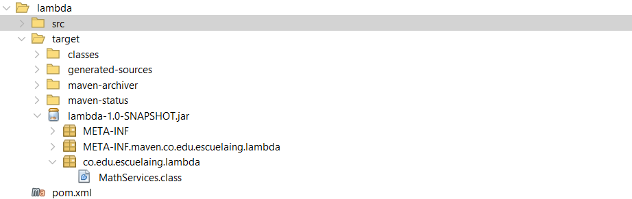

### Cree la función lambda
**1.** *Acceda al servicio Lambda*

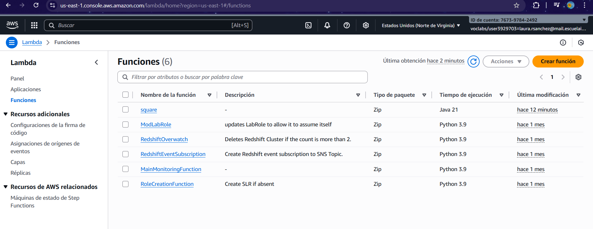

**2.** *Oprima el botón de crear una función. Cree la función desde el inicio (From scratch)*

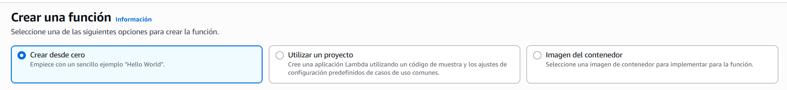

**3.** *Asígnele un nombre, por ejemplo “square"*

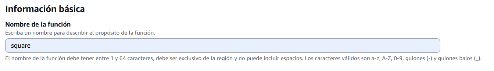

**4.** *Seleccione el “Runtime” a Java 21*

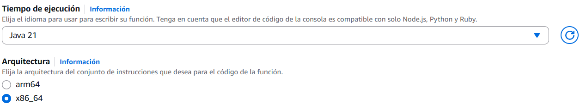

**5.** *Seleccione usar un Rol existente y use el rol que creó en el paso 1.*
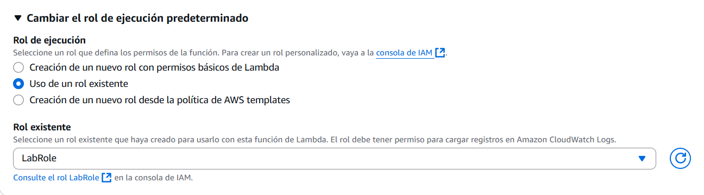

Ahora vamos a cargar el código y a probar que funcione:

**1.** *En la sección “Function code” cargue el código*

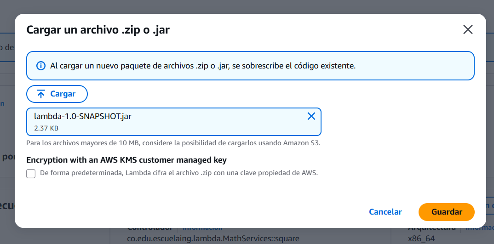

**2.** *En el campo “Handler” escriba: {ruta de la clase incluyendo el paquete}::{Nombre del método}. Es decir:*
````
co.edu.escuelaing.lambda.MathServices::square
````

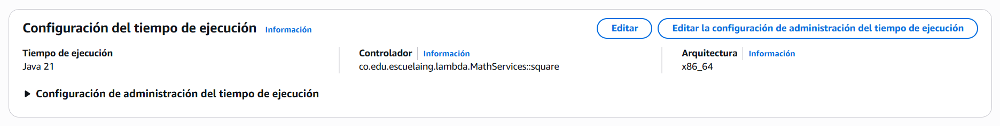

Ahora vamos a probar que funcione:

**1.** *En la parte superior en el cuadro de selección que dice ”Select a test event” seleccione “Configure test events”.*

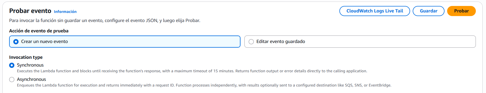

**2.** *Asigne un nombre de evento, por ejemplo “testSquare"*

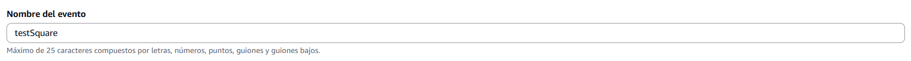

**3.** *En el cuadro de texto, borre el JSON que aparece y solo deje el número 5*

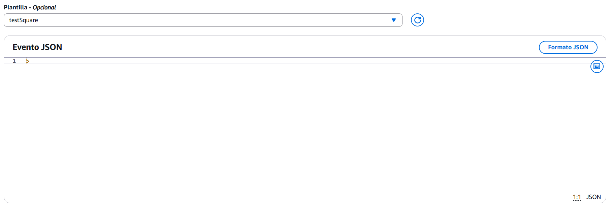

**4.** *Oprima el botón de crear.*

**5.** *Una vez creado ya puede oprimir el botón de “Test” y debería obtener un resultado similar a este:*

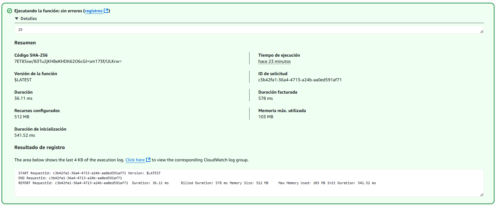

### Configurar el API Gateway para exponer el servicio

**1.** *Abra el servicio de API Gateway*

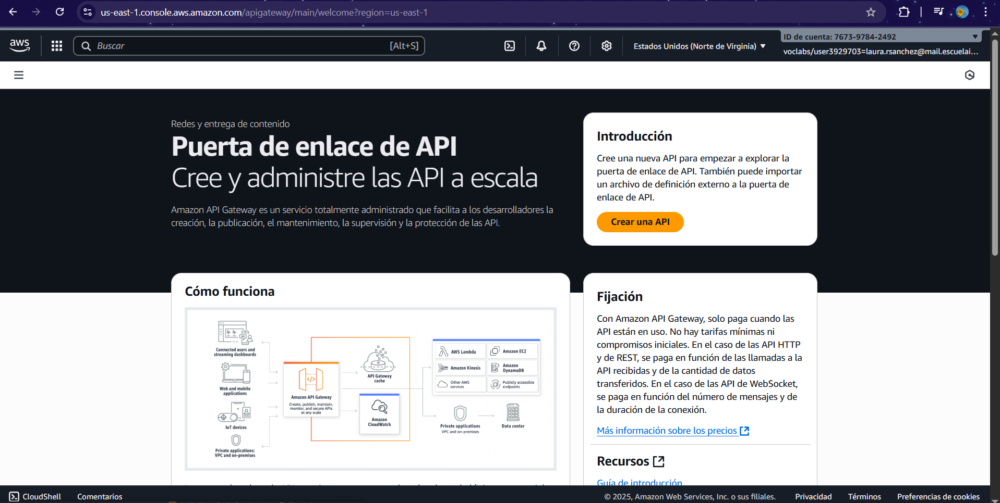

**2.** *Selecciones las opciones de API REST, New API*

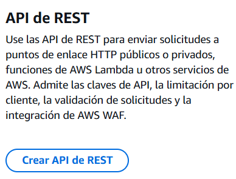

**3.** *Asígnele un nombre al API, ejemplo, mathServices*

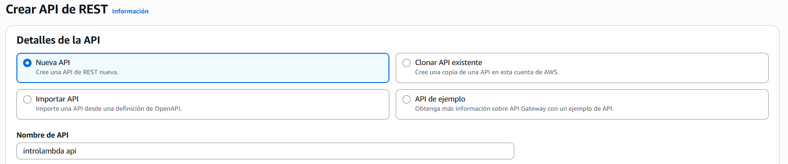

**4.** *Y seleccione el end point de tipo regional.*

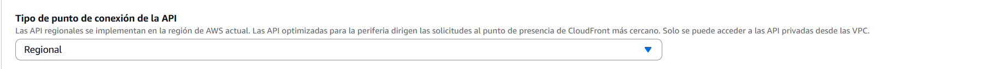

Le debe aparecer algo así:

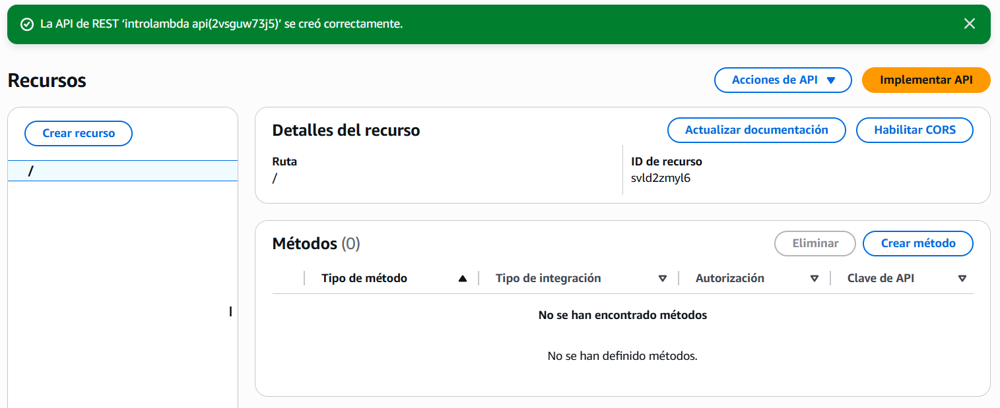

Ahora vamos a crear una forma de acceder a este API. Para esto vamos a crear un método http GET que reciba la solicitud e invoque nuestra función:

**1.** *En el API en el botón de acciones al lado de recirsoso seleccione “Create Method"*

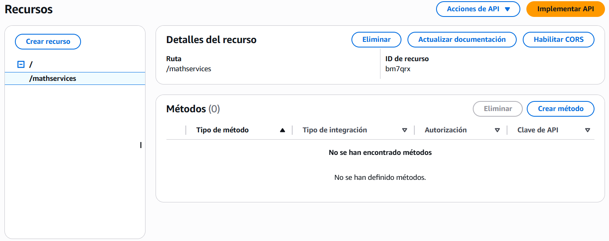

**2.** *Seleccione el método GET y confírmelo oprimiendo el chulo.*

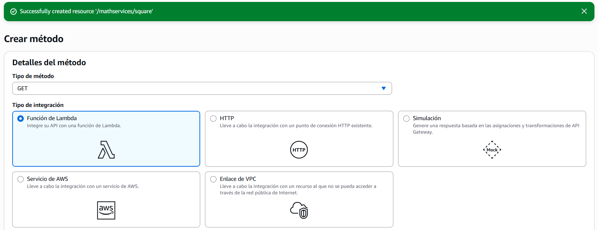

**3.** *En el campo de “Lambda Function” escriba el nombre de la función que creó en le paso anterior y salve.*

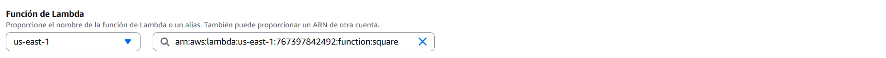

Al crearlo debes ver algo así:

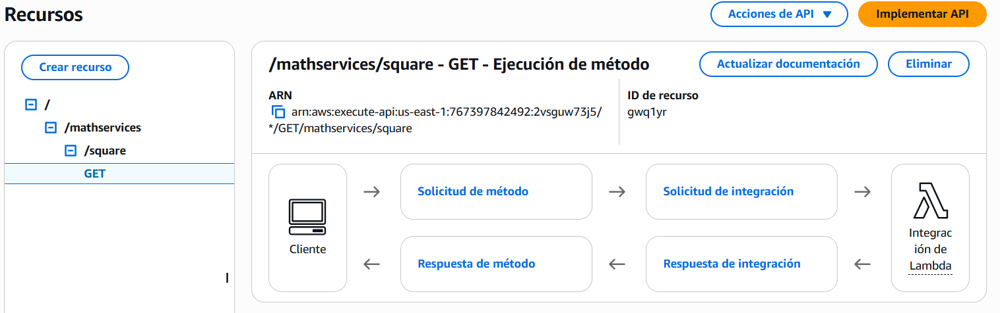

**4.** *Haga Click sobre Method Request*

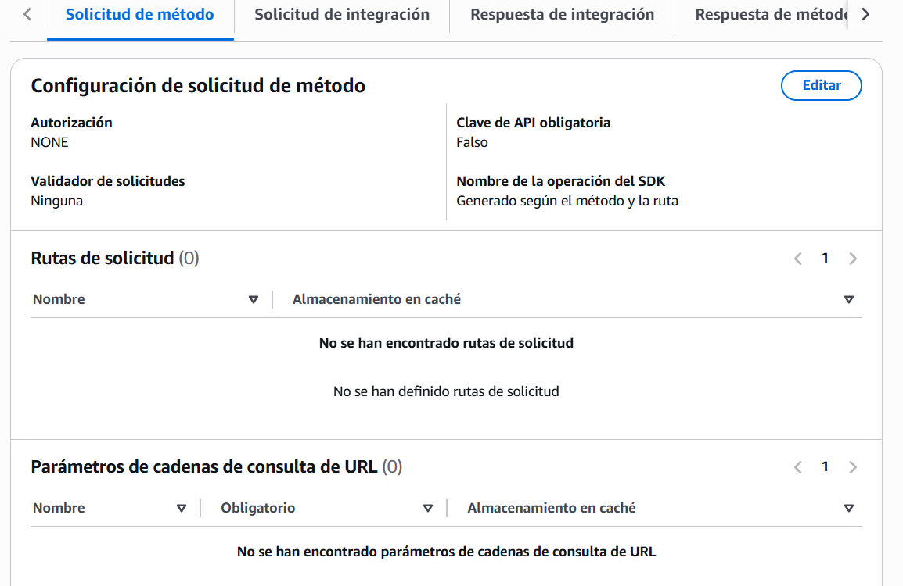

**5.** *Agregue el parámetro “value” en "URL Query String Parameters”:*

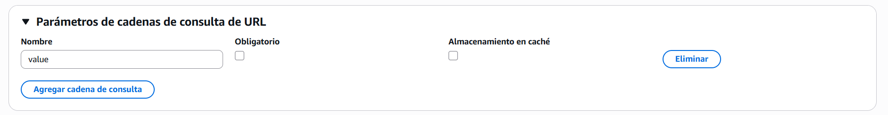

**6.** *Ingrese a “Integration Request"*

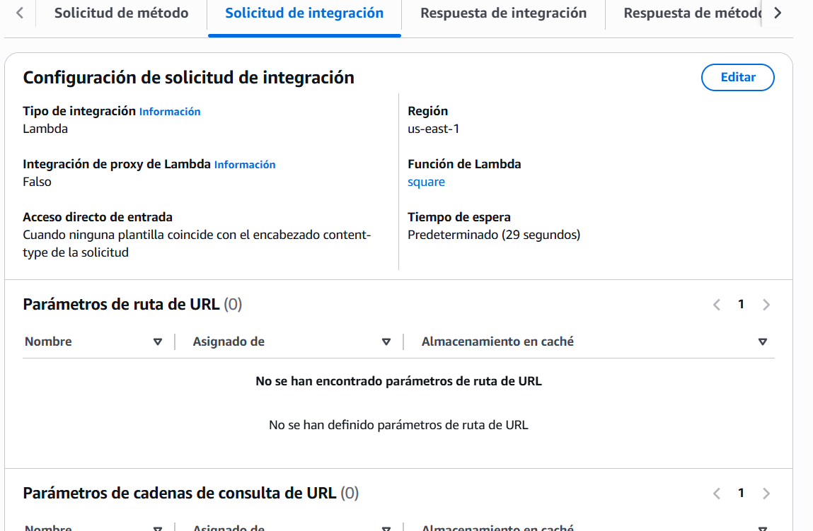

**7.** *Mapee el parámetro que identificó en el paso anterior para poder usarlo. Para esto cree en "URL Query String Parameters” un parámetro denominado “value” que obtenga el valor del anterior que se había extraído de la cadena de query. PAra esto debe mapearlo a `method.request.querystring.value` así:*

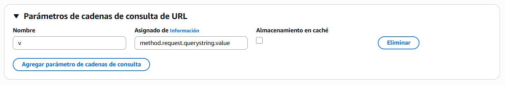

**8.** *Ahora configure un mapping template para indicar cómo se pasarán los parámetros a la función lambda. OJO: Por defecto muchas de las opciones y ejemplo en internet intentan pasar un objeto JSON con los parámetros, esto es muy útil. Pero para efectos del tutorial vamos a pasar solo un número.
Adicione una mapping template así:*

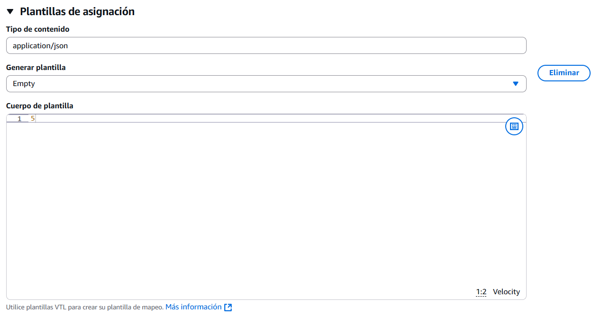

**9.** *Mire que asignamos un solo valor por ahora, esto para que entienda que esto es los que queremos construir, esto es los que le vamos a pasar la función lambda. Usted ya puede probar la función:
Saliendo a la definición del método, Luego entra al test y ejecútelo, El resultado siempre será el mismo porque estamos pasando una constante*

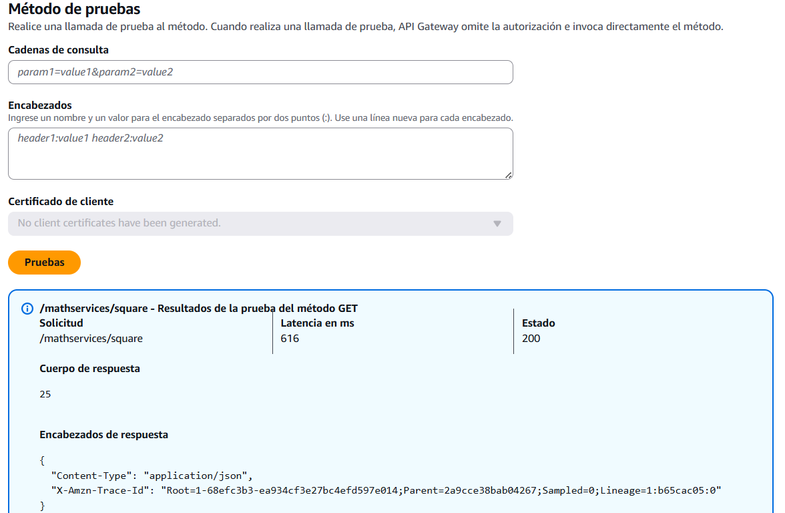

**10.** *Ahora vamos a modificar el “Template de mapeo” para que podamos pasar parámetros. En el template la variable $ input representa la carga útil de entrada y los parámetros que debe procesar su template. Puede enconytrar la documentación de los templates de Mapeo en : https://docs.aws.amazon.com/apigateway/latest/developerguide/api-gateway-mapping-template-reference.html*

- *Por ahora lo que necesita es extraer el valor del parámetro que configuró arriba. Escriba lo siguiente en la caja de texto para configurar el mapeo `$input.params("value")`.*

    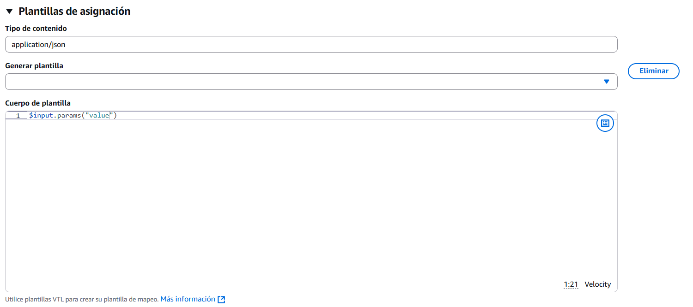

- *Ahora pruebe nuevamente la funcionalidad. no olvide incluir una parámetro "value" con un valor entero en la prueba. si no lo incluye se debe reportar un error. Antes de hacer la prueba usted verá algo así:*
   
    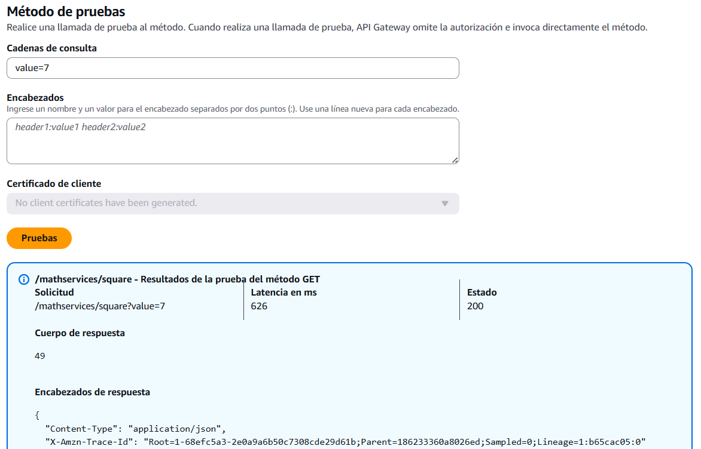

**11.** *Ahora vamos a publicar el servicio para hacerlo disponible sobre internet. En el botón de “Actions” seleccione la opción de desplegar*

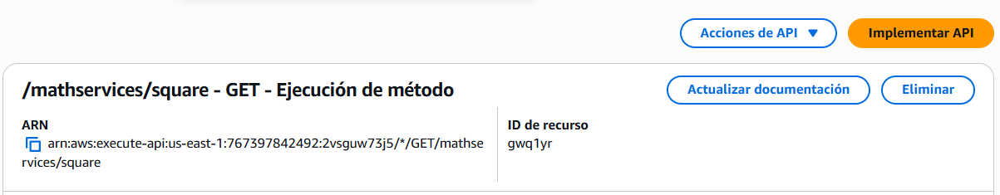

**12.** *En la ventana que parece seleccione la opción de “[New Stage]” y dele un nombre cualquiera, por ejemplo Beta. Aquí podrá manjar otras etapas como pruebas y producción.*

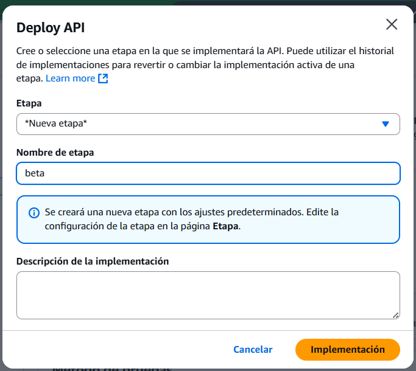

**13.** *El resultado debe ser como se muestra a continuación:*

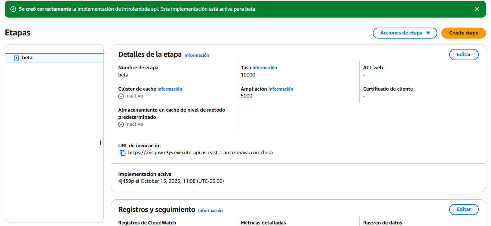

**14.** *La URL que aparece en la parte superior le sirve para invocar el servicio:
Intente invocarlo con una URL como esta (no olvide el parámetro):
`https://2vsguw73j5.execute-api.us-east-1.amazonaws.com/beta/mathservices/square?value=11`
Y deberá obtener una resultado com este:*

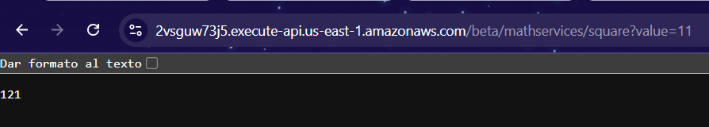

### Parte 2 del Taller

Creamos las siguientes clases:

````java
package co.edu.escuelaing.lambda;

public class SecurityUtils {
    public static User login(User u){
        System.out.println("Username: " + u.getUsername());
        System.out.println("password: " + u.getPassword());
        u.setPassword("");
        return u;
    }
}
````

````java
package co.edu.escuelaing.lambda;

class User {
    
    private String username;
    private String password;
    
    public User(){}

    /**
     * @return the username
     */
    public String getUsername() {
        return username;
    }

    /**
     * @param username the username to set
     */
    public void setUsername(String username) {
        this.username = username;
    }

    /**
     * @return the password
     */
    public String getPassword() {
        return password;
    }

    /**
     * @param password the password to set
     */
    public void setPassword(String password) {
        this.password = password;
    }
    
    
}
````

Compilamos y verificamos que se hayan creado los siguientes archivos:

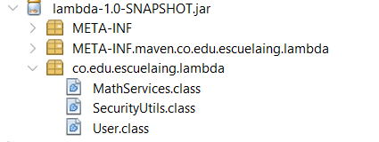

Creamos la función lambda como se hizo en la parte anterior del taller y realizamos una prueba:

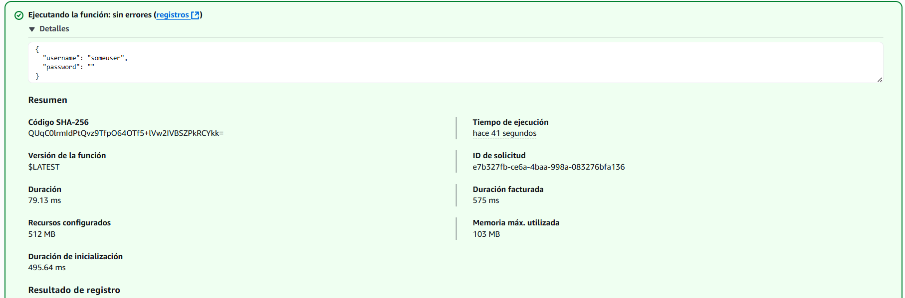

Repetimos el proceso para crear el método en la api gateway:

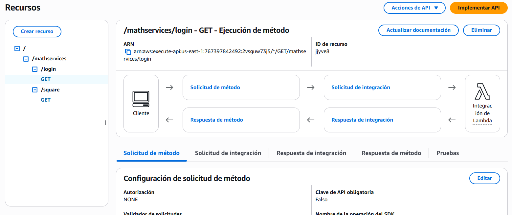

Lo configuramos como hicimos en la parte anterior y probamos:

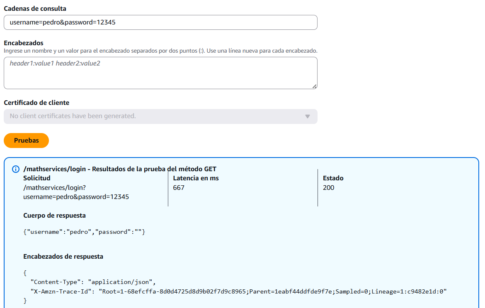